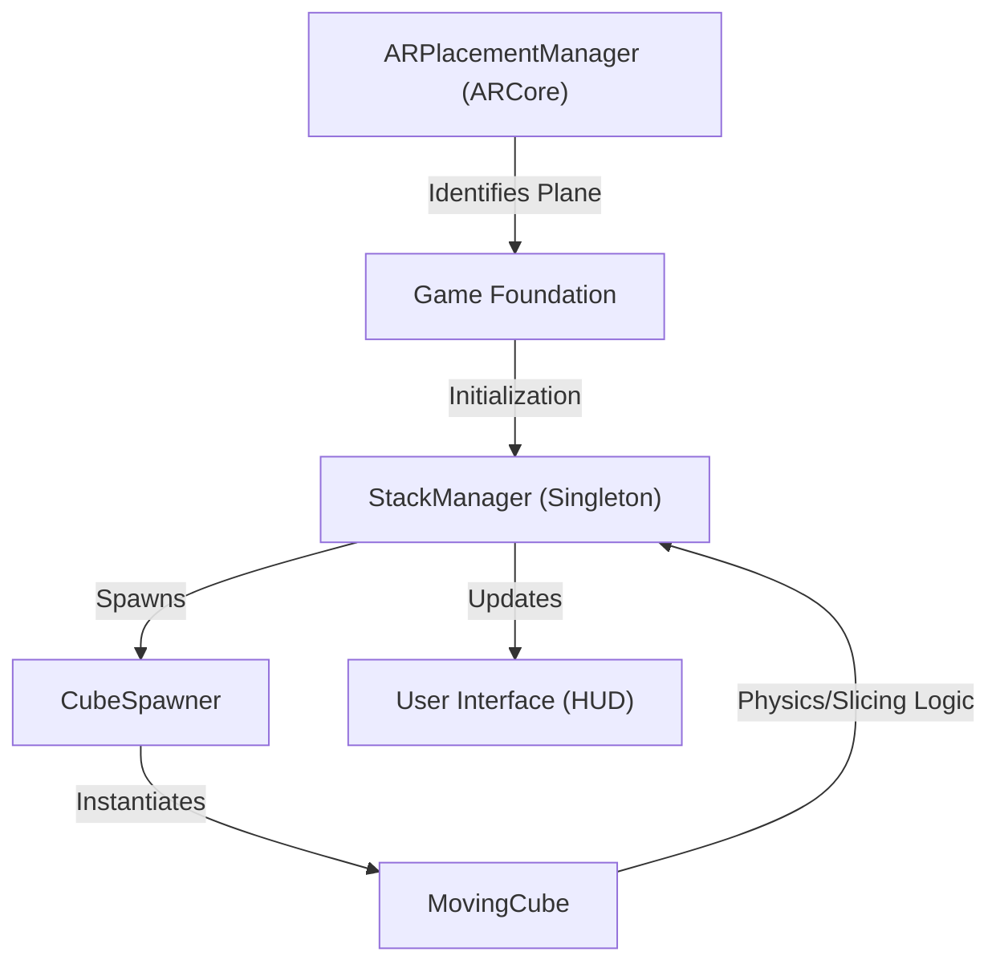

# Technical Specification: AR Stack Builder Game

## Architectural Overview

The **AR Stack Builder Game** is a mobile augmented reality application developed using the **Unity 3D Engine** and **AR Foundation** (specifically targeting Google's **ARCore** SDK). The application demonstrates the integration of real-world spatial mapping with virtual physics-based interactions.

### Component Diagram

---

## Technical Implementations

### 1. Augmented Reality Integration
The application leverages the `ARRaycastManager` to bridge the physical and virtual environments through horizontal plane detection.

- **Surface Mapping**: The system performs a viewport-to-screen conversion at `(0.5, 0.5)` to cast a ray from the center of the camera.
- **Pose Estimation**: Upon a valid `ARRaycastHit` against a `PlaneWithinPolygon` trackable, a `Pose` (position and rotation) is extracted to anchor the game board.

### 2. Oscillation and Axis Control
To provide the game's core challenge, blocks oscillate periodically along alternating axes.

- **Algorithm**: `Mathf.PingPong(Time.time * speed, length)` is utilized to create a continuous back-and-forth movement.
- **Directional Switching**: The `CubeSpawner` uses the Y-coordinate (stack height) to determine the next movement axis:
    - `Y % 2 == 0`: X-Axis Oscillation.
    - `Y % 2 != 0`: Z-Axis Oscillation.

### 3. Slicing and Stacking Logic
The "slicing" mechanic defines the difficulty curve and structural integrity of the stack.

- **Hangover Calculation**: The offset is calculated between the `CurrentCube` and the `LastCube` positions.
- **Scoring Condition**: If the hangover magnitude remains within the allowed threshold (the width of the previous block), the stack persists, the score increments, and the `LastCube` reference is updated.
- **Failure Condition**: If the center of mass shifts beyond the support boundaries, the game triggers the `EndGame` sequence via the `StackManager`.

### 4. Game State Management
The application follows a strict Singleton pattern for structural stability.

- **StackManager**: Serves as the central arbiter for game logic, managing transitions between `Start`, `Active`, and `GameOver` states, and coordinating UI updates.

---

## Technical Prerequisites

- **SDK**: Unity XR AR Foundation (v3.1.3+)
- **Device**: ARCore-enabled Android (API Level 24+)
- **Tracking**: 6-DOF (Degrees of Freedom) tracking required for depth perception.

---

*This document serves as the formal technical authority for the AR-STACK-GAME archival project.*
